# 端云互通组件-MQTT开发指南

## 目 录
<!-- TOC -->

- [1 前言](#1)
- [2 SDK简介](#2)
- [3 接入物联网平台流程](#3)
- [4 直连接入实例](#4)
	-  [4.1 平台侧开发](#4.1)
	-  [4.2 设备侧开发](#4.2)
	-  [4.3 调测](#4.3)
- [5 经BS接入实例](#5)
	-  [5.1 平台侧开发](#5.1)
	-  [5.2 设备侧开发](#5.2)
	-  [5.3 调测](#5.3)
<!-- /TOC -->

<h1 id="1">1.前言</h1>
  本文档主要通过实例讲述如何通过Huawei I-CUBE的端云互通组件，使用MQTT协议快速接入华为物联网平台。

<h1 id="2">2.Huawei I-CUBE简介</h1>

Huawei I-CUBE是华为联合意法半导体合作推出的支撑意法开发板快速连接华为云的SDK。此SDK基于华为IoT Device SDK Tiny精简而来。

IoT Device SDK Tiny是部署在具备广域网能力、对功耗/存储/计算资源有苛刻限制的终端设备上的轻量级互联互通中间件，您只需调用API接口，便可实现设备快速接入到物联网平台以及数据上报和命令接收等功能。
IoT Device SDK Tiny是Huawei Agent Tiny软件开发工具包（Software Development Kit），通过IoT Device SDK Tiny端云互通组件，简单快速地实现与华为物联网平台安全可靠连接，可以大大减少开发周期，
快速构建IoT产品。端云互通组件可以采用MQTT、CoAP和LwM2W协议接入物联网平台。

**IoT SDK的全景图**

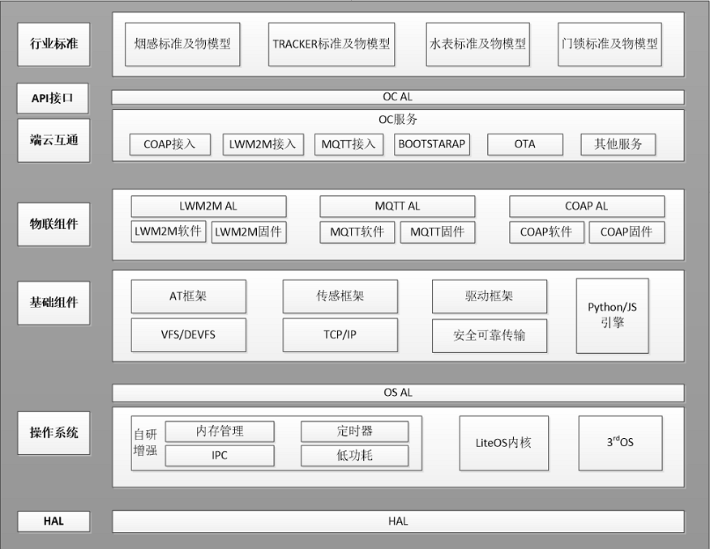

<h1 id="3">3.接入物联网平台流程</h1>

端云互通组件接入华为物联网云平台支持多种接入方式，包括：有线、WIFI、GSM、NB-IoT等无线方式。

平台对接信息

<table>
<thead align="left">
<tr id="row25383117">
<th class="cellrowborder" valign="top" width="50%" id="mcps1.2.4.1.1">
平台环境

</th>
<th class="cellrowborder" valign="top" width="50%" id="mcps1.2.4.1.2">
获取途径

</th>
</tr>
</thead>
<tbody>
</tr>
<tr id="ZH-CN_TOPIC_0187644975__row6123185510311">
<td class="cellrowborder" valign="top" width="23.5%" headers="mcps1.3.1.3.1.3.1.1 ">
华为物联网平台
 </td> 
<td class="cellrowborder" valign="top" width="76.5%" headers="mcps1.3.1.3.1.3.1.2 ">
进入
<a href="https://console.huaweicloud.com/iotdm/?region=cn-north-4#/dm-portal/device/all-device" target="_blank" rel="noopener noreferrer">华为物联网平台</a>
的具体项目中，在“应用
 &gt; 对接信息”页面查看
“设备接入信息”和“应用接入信息”。

 
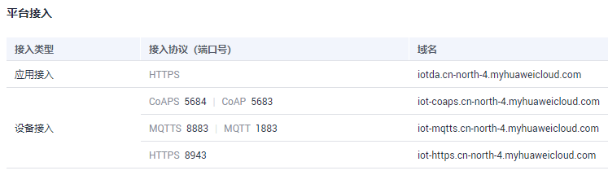
 </td> 
</tr> 
</tbody>
</table>

设备接入云端可分为直连接入和BS引导接入，如下示意图

**图 1**  直连接入物联网平台示意图
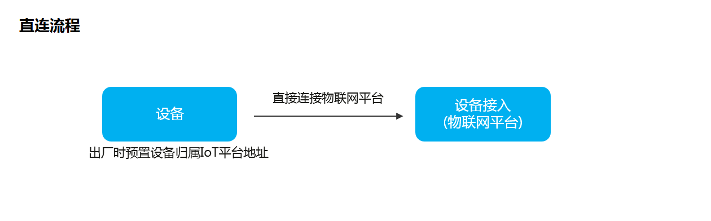

**图 2**  BS引导接入物联网平台示意图
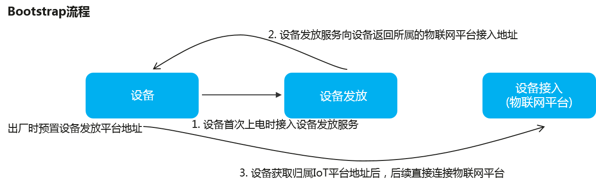

本直到采用直连方式接入。

<h1 id="4">4、接入实例</h1>

设备接入云端可分为直连接入和BS引导接入，本手册采用直连方式。

<h1 id="4">4.直连接入实例</h1>
**图 1** 直连模式下整体配置流程

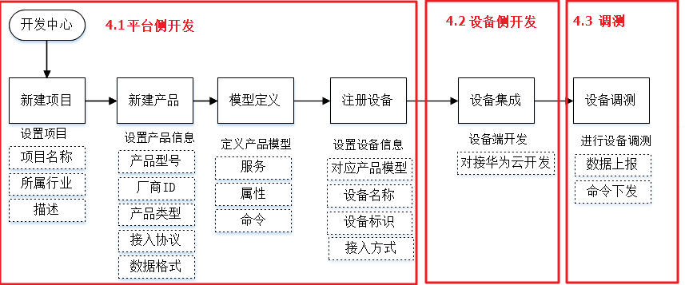

<h2 id="4.1">4.1 平台侧开发</h2>
使用“开发中心”完成平台侧的开发。开发中心是基于设备管理服务提供的一站式开发工具，帮助开发者快速开发产品（Profile、编解码插件）
，并进行自动化测试，生成测试报告。平台侧配置流程包括：新建项目，新建产品、开发profile，开发编解码插件，注册设备。

<h5>1、环境准备</h5>

在开发之前，需要提前获取如下信息：

-   [开发中心](https://console.huaweicloud.com/iotdm/?region=cn-north-4#/dm-portal/home)的访问账号/密码，需要向华为物联网平台申请

<h5>2、产品开发</h5>

在物联网平台中，某一类具有相同能力或特征的设备的合集被称为一款产品。产品包含Profile（产品模型）、编解码插件、测试报告等资源，
其中产品信息被记录在Profile中。产品的Profile文件用来描述设备类型和设备服务能力。它定义了设备具备的服务能力，每个服务具备的属性、
命令以及命令参数。

创建步骤：

1.  登录IoT平台的开发者中心。
2.  点击左侧导航栏中的“产品”进入产品界面，点击页面左上角的“创建产品”开始新建产品

平台支持从已有设备定义设备，即下图中的“使用模型定义设备功能”。这里，我们自己定义我们的设备如下图所示定义我们的设备：

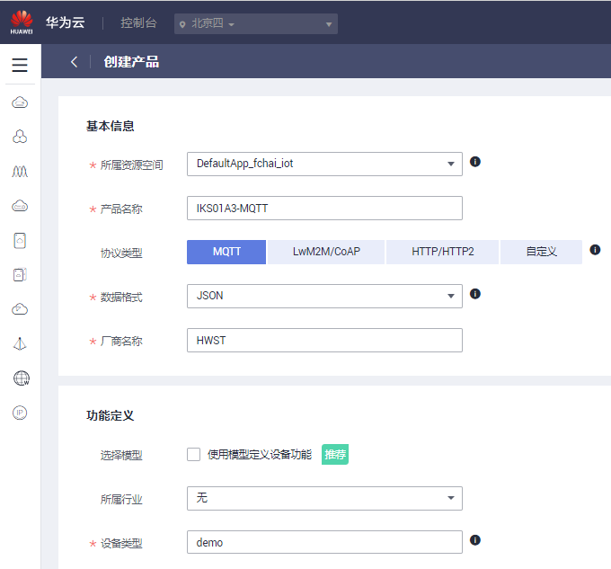

填好信息后点击右下角的“立即创建”按钮，然后我们就创建好我们的产品了。

3. 在产品界面找到我们刚刚创建的产品，点击刚刚创建的产品名称，然后在产品界面点击“自定义功能”按钮

4. 在弹出的“新增服务”界面中输入"SensorService"然后点击确认

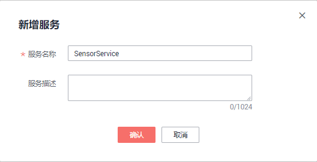
5. 服务创建好以后，点击服务开始添加属性按下图添加温度，湿度和压力，三轴x，y，z：

   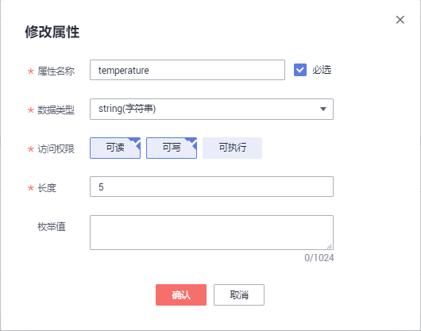

   

   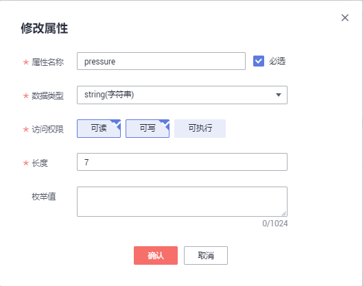

   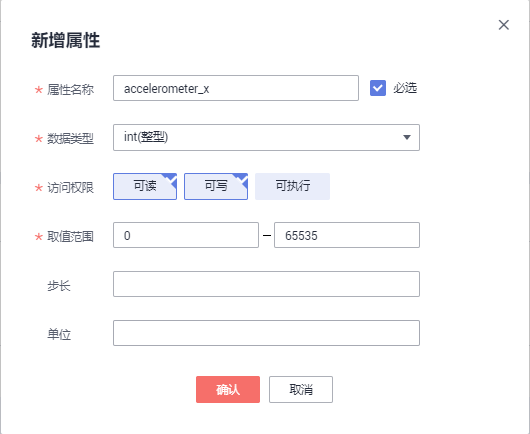

   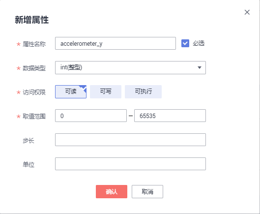

   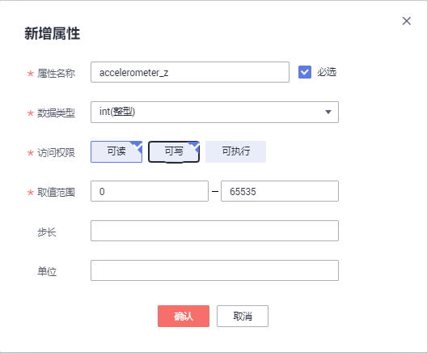

<h5>3、添加设备</h5>

平台通过接入设备，对开发的应用和设备进行在线调测，并进行统一的设备管理。

如下图所示标号所在的按钮进入添加设备界面：

**图 1**  注册设备信息  
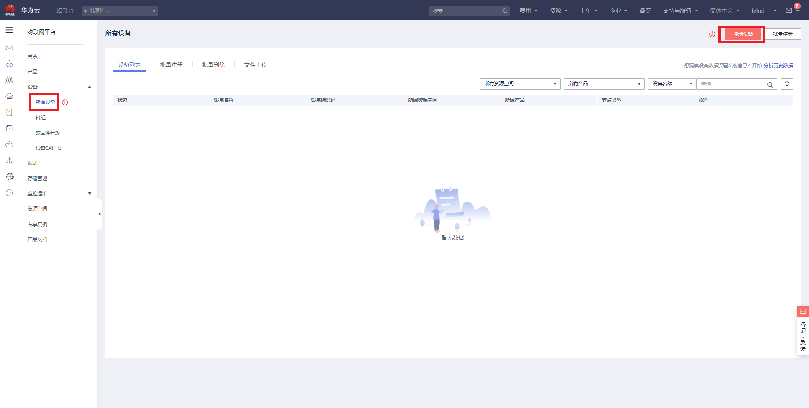

在设备注册界面中输入如下信息，设备识别码和设备名称酌情自行填写下图仅为示例：

**图 2**  注册设备信息  
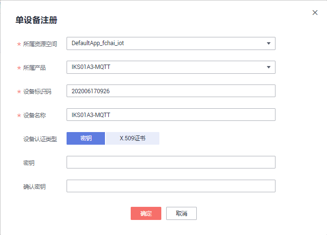

点击确定

您将会看到类似下面的界面：

**图 3**  注册设备完成  

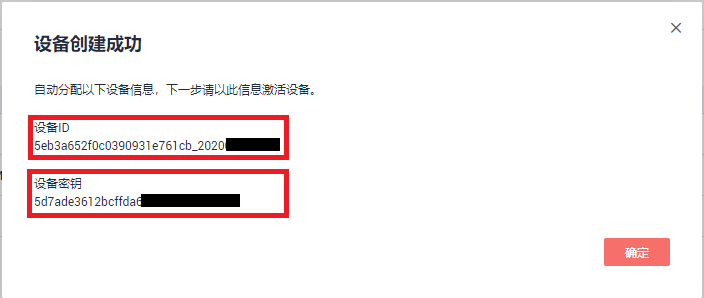

**请务必记住上图中红框内的设备ID和设备密钥。**下文要用。

<h4 id="4.2">4.2、设备侧开发 </h4>
直连模式设备侧开发包括: 配置Demo中对接云端设备的信息、编译、运行SDK、数据上报任务与命令下发调测。

<h5 id="">设备侧开发环境准备</h5>
在开发之前，需要提前进行如下操作：

- 建好工程（本包已经包含了响应的工程）
- 将开发板，传感器板，模组连接好。

**图 1** 开发板连接  

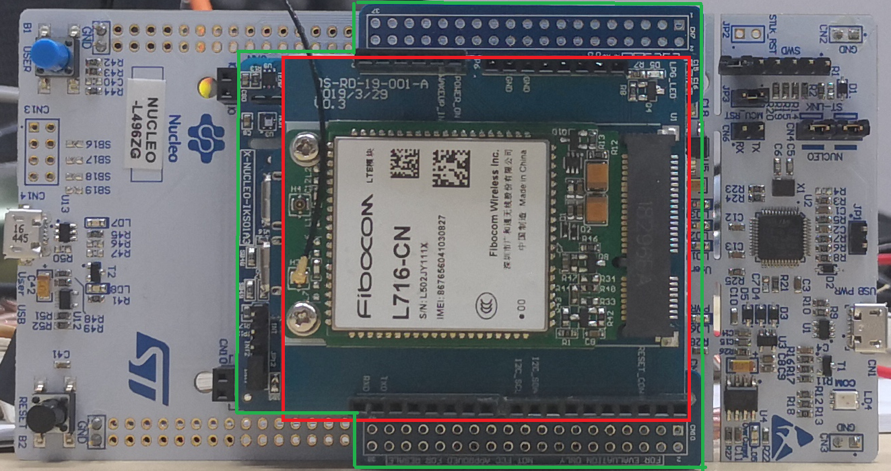

注：图中白色底板为STM32L496 Nucleo-144开发板，绿色线框内为意法半导体的传感器板（IKS01A3），红色框内为模组，基于广和通L716-CN的迪尚模组。**请在安装模组前装好SIM卡**，另外，**模组需要单独供电**。

编辑mqtt工程目录中的"iot_config.h"文件，将"CONFIG_MQTT_DEVID"和"CONFIG_MQTT_PASSWD"的值改为前面创建设备时返回的设备ID和设备密钥。

然后编译工程，下载就可以了。

查看设备状态

按下图红色数字标注的顺序可以打开设备信息界面。

**图 2**  查看设备状态  
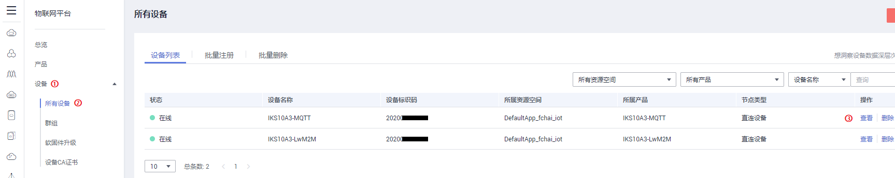

然后就可以看到设备的状态：

**图 3**  设备状态  

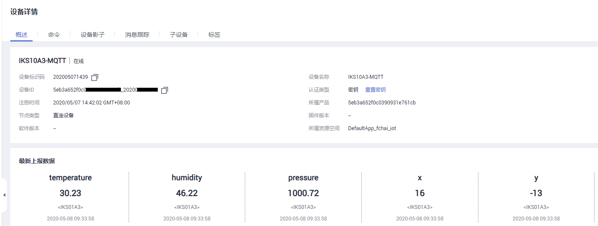