# MQTT OTA开发指南

##前言
  本文档主要介绍通过MQTT实现固件升级（OTA）功能。

##OTA功能简介
  华为云平台支持通过OTA机制进行板载固件包的升级。

  由于软件是运行在FLASH上的，所以升级需要更改FLASH的内容。但软件不能更改自己本身的内容。所以升级时必须重启由另外一个软件进行内容的更改。这个软件一般称之为bootloader。所以OTA的端测运行时流程大致为：
  + 云平台发起请求进行固件包升级
  + 端测从云平台下载新固件包
  + 端测下载完毕后更新与bootloader交互的标记区域
  + 端测设备重启
  + 端测bootloader根据标记区域进行软件升级

  如您所见，升级请求是由服务器发起的。所以我们想要使用OTA能力需要先上传升级包到服务器。那么我们就需要制作升级包。升级包的制作步骤大致为：
  + 留存老版本的bin文件
  + 编译生成新版本的bin文件
  + 使用差分工具制作差分包
  + 使用签名工具对差分包进行签名

  完成以上步骤后就可以将最终签名后的差分包上传到服务器。服务器会随后和正在运行的端测设备互动升级。

##地址区间划分
  由于我们需要在端测设备上预留bootloader以及业务本身的固件（包含OS，连云SDK以及用户业务）。而且升级过程需要下载升级包，业务固件需要给bootloader传递升级相关参数，为预防升级失败需要备份上一次可以正常执行的固件代码。所以端测设备需要FLASH地址划分做对应的功能使用。基于以上需求，端测需要划分一下功能的区间：
  + bootloader代码区域
  + 业务固件区域
  + 升级包下载区域
  + 上一次正常固件备份区域
  + 业务给bootloader参数传递区域

当然本SDK中的实例工程已经完成了这些区域的划分。

##loader
  打开SDK自带的`loader`工程目录，然后可以直接编译下载。运行起来后如下图所示。

  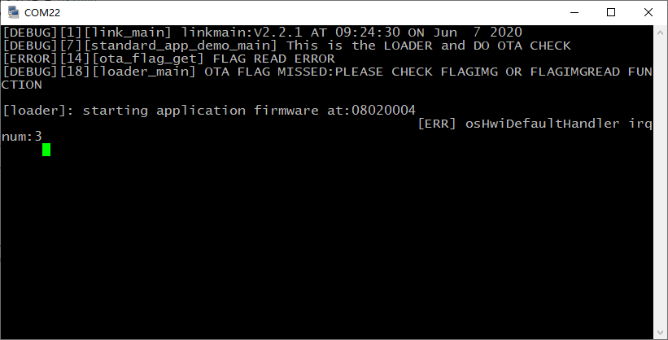

  我们可以看到，在loader起来后，会尝试加载application固件，由于application固件未烧写，所以跑飞掉了。当我们刷入application固件后就可以通过loader启动了。

##application固件
  application固件可以在名为<mqtt>的目录中找到。编译后下载到开发板上。启动板子会看到application固件已经被加载起来了。
  application固件起来后会自动连接云平台。不过注意，一定要修改您自己的mqtt设备ID和密码。

##OTA升级时的交互（版本）
  在升级的时候，开发者需要上传固件，在上传固件的时候需要指定当前固件的版本号。在执行升级逻辑时，云平台会询问端测设备的版本号信息。如果是版本号与上传的固件的版本号不一样则启动升级流程。端测设备下载升级包。
  在当前的工程中，版本响应，上报逻辑已经实现，上报的版本号由`oc_demo.c`中的宏`CN_OTA_FOTA_VERSION`定义。其默认值为`"FOTAV1"`。

##云端mqtt profile设定
  云端的设备profile需要使能升级功能。如下图所示：
  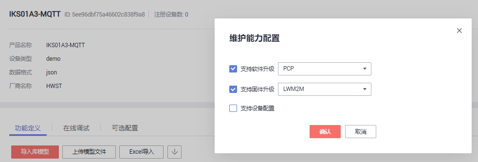
  注意图中信息（"PCP"和"LWM2M"）显示不准确。先忽略它。

##升级包制作
###生成application bin文件
  bootloader烧好云平台设备profile设置正确后就可以制作升级包了。
  升级包是基于二进制`bin`文件制作的。如果使用的是keil工程，需要在keil工程的如下设置中添加生成bin文件的命令：
  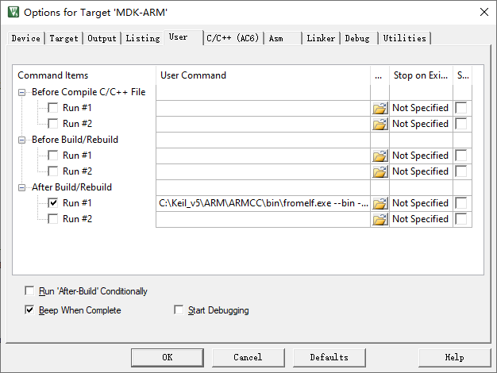
  其命令类似于：`C:\Keil_v5\ARM\ARMCC\bin\fromelf.exe --bin -o ./keil/@L.bin  ./keil/@L.axf`
  这样，在编译完成后会同时生成bin文件。

###升级包生成
  首先我们确保前面步骤中的loader和application可以直接运行并且连接云平台。在此基础上我们稍微修改下我们的demo：
  1. 更改版本号，`CN_OTA_FOTA_VERSION`的值改为`"FOTAV2"`。
  2. 在我们的代码启动处增加一处打印，比如`printf ("NEW VERSION\n");`。
然后编译生成新的bin。
    注意：如果要做差分包，请保存老版本的bin文件。

  在SDK的根目录下的`Utilities/ota_tool`目录下解压`ota_tool.zip`。然后打开解压后的`ota_tool.exe`。
  然后我们可以看到如下界面：
  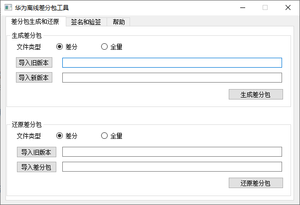
  我们可以看到，差分包可以同时支持差分包和全量包。我们两种模式都支持。

####差分包制作
  差分包的制作需要老版本application固件的bin文件以及新版本的bin文件，分别选择后点击`生成差分包`然后保存为`.bin`格式的文件。即可以生成差分包bin文件。
####全量包制作
  全量包的制作需要点击选择`全量`选项框，然后只需要选择新的固件bin文件然后点击`生成差分包`然后保存为`.bin`格式的文件。即可以生成全量包bin文件。
####压缩
  假设签名生成的差分包或全量包文件名为`FOTA2.bin`。我们需要将其压缩为`.zip`文件，比方说`FOTA2.zip`。
###升级包签名
  在SDK的根目录下的`Utilities/ota_tool`目录下解压`signtool.zip`。解压后会看到两个文件`signtool-chinese.zip`和`signtool-english.zip`。我们选择`signtool-chinese.zip`继续解压。
  我们打开最后解压出来的`signtool.exe`。
  如下所示：
  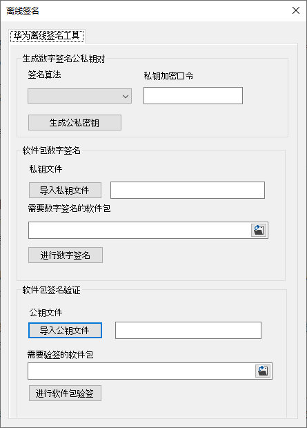
####生成公私密钥
  选择如下图所示的算法，然后输入一个密钥，比如`abc123`。注意这个密钥不能太简单。
  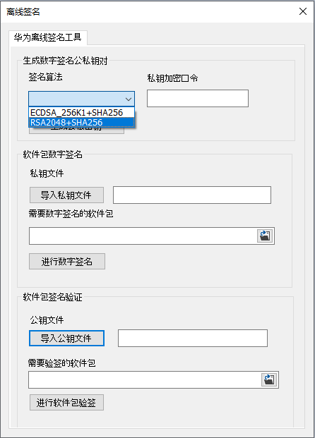
  然后点击`生成公私密钥`然后选择保存即可生成

####签名升级包
  如下两个红框中的两个红框分别选择刚刚生成的私钥文件以及前面步骤生成的差分包或全量包（`FOTA2.zip`）。
    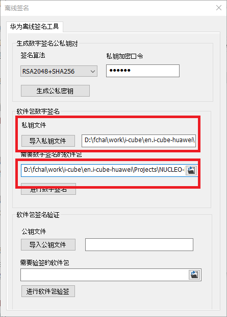

然后点击`进行数字签名`即可生成签名文件`FOTA2_signed.zip`。

##上传差分包
###上传公钥
  打开华为云管理平台，如下图所示点击`上传`：
  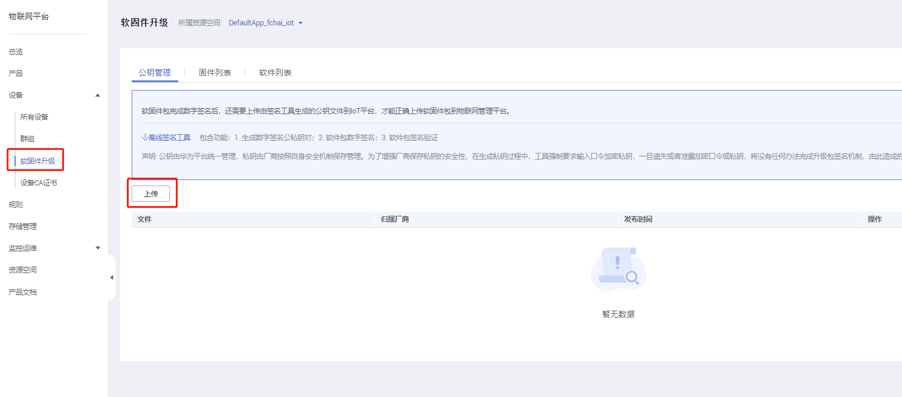
  如下图所示：
  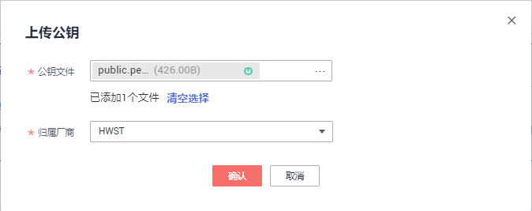
  然后点击确定。

###上传固件
  如下图所示
  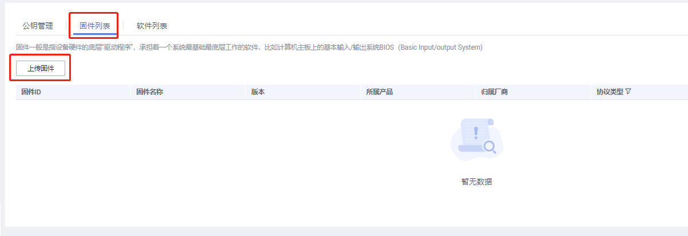
  点击上传固件，然后如下图所示选择，注意，这里的版本一定要与设备将要上报的版本一致：
  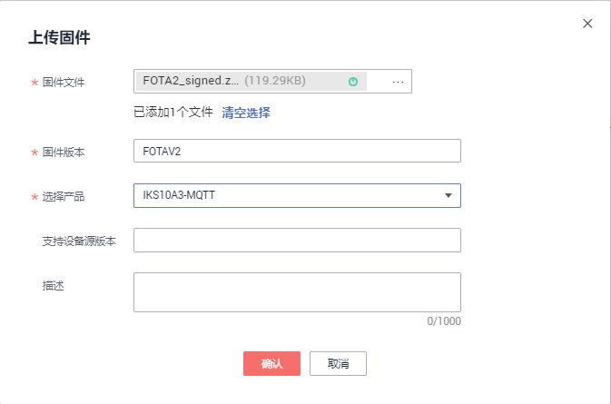
  如下图所示进入策略界面：
  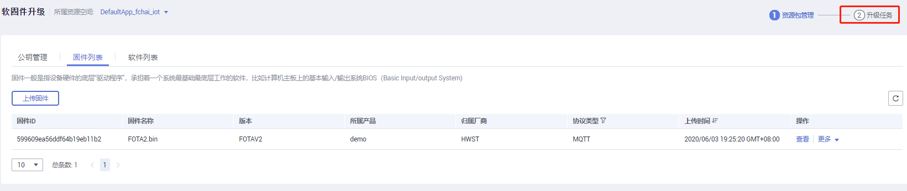
  点击`新建策略`
  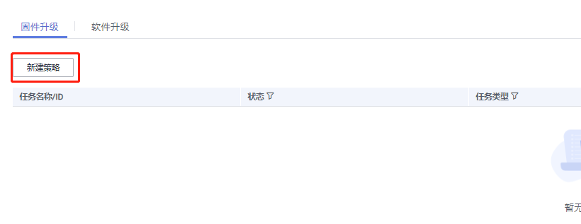
  填入以下信息：
  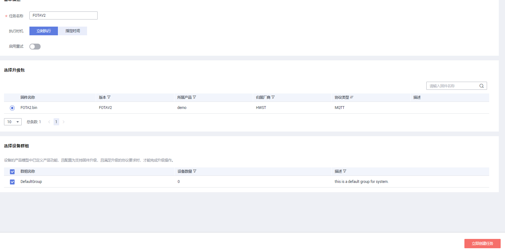

最后点击右下角的红色按钮即可创建好任务

策略创建后，很快就会与端测进行升级流程的交互，端测会下载升级包。然后重启后进行升级处理。